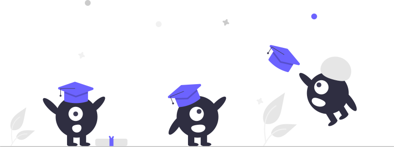

# Learning Is a Lifelong Game 📖

<table width="100%" border="0" cellspacing="0" cellpadding="0" style="border-collapse: collapse; border: none;">
  <tr>
    <td width="45%" align="center">
      
    </td>
    <td width="43%" align="center">
      
    </td>
  </tr>
</table>

## About Me

👋 Welcome to my page！

🧑‍💼 I am an engineer passionate about software development and committed to continuous learning. Here is a webpage shows my resume:

➡️ <https://coffic.cn/founder>  

## My Wonderful Works

💪 I will continually learn and research for a goal. Here are links to showcase all of my works:

➡️ <https://coffic.cn>  
➡️ <https://github.com/CofficLab>

🍉 If you are interested in my stories, please send me a message.
